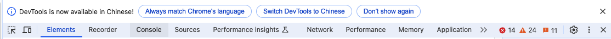
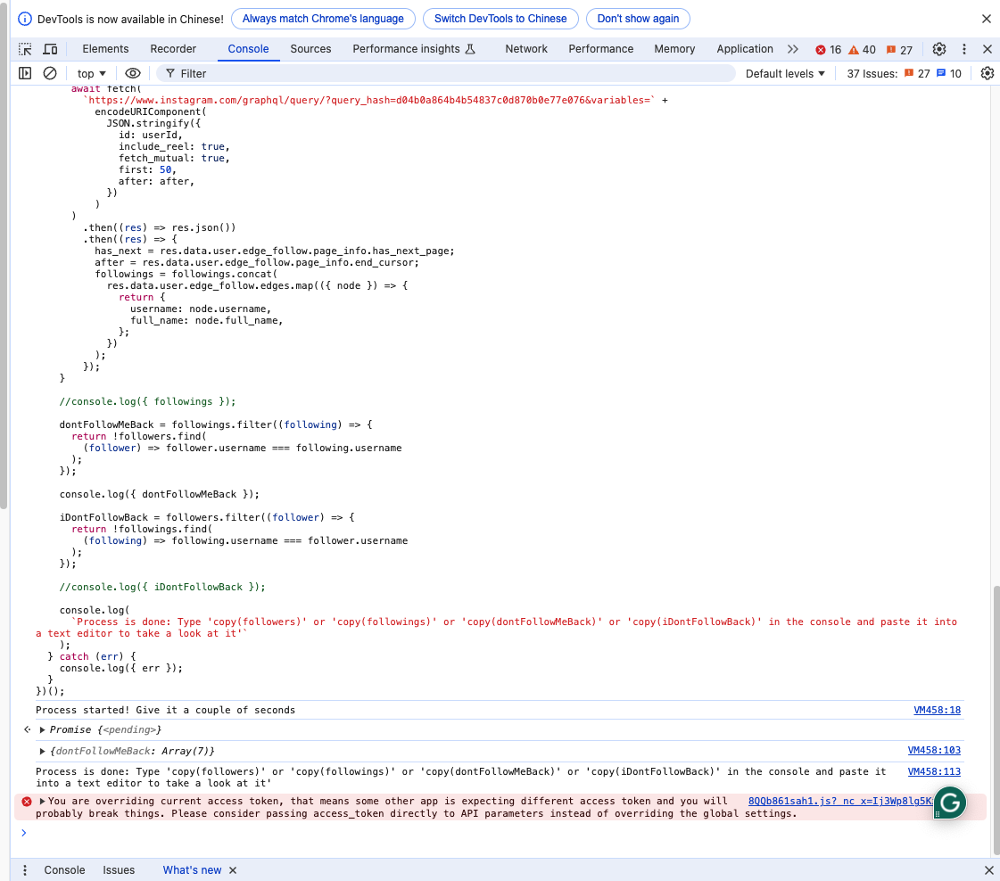

# 如何得知誰沒有回追你？

### 1. 打開 Chrome 瀏覽器，並且造訪 Instagram 網站

- 不一定要使用狗狗的帳號，任一帳號都可以！

### 2. 開啟 Chrome 的檢查工具

首先，點選滑鼠的右鍵，會出現一個對話方框：


按下**檢查**：


接著我們會看到一坨酷酷的工具：


注意畫面的右上角，會有一欄導航列：



我們會使用到 `Console` 工具，點擊一下 `Console` 按鈕後，工具會變成這樣：


你可能會因為警示訊息或是密密麻麻的錯誤而感到害怕，但不用擔心，這篇文章教的方式並不會違反 Instagram 的使用原則。

### 3. 準備程式碼

上一步驟點開的 Console 是可以幫助我們在對話窗內執行一些程式碼的（通常都是網頁工程師用來除錯的），這次酷寶拔幫大家把程式碼準備好了：

> 使用前記得把程式碼的第一行 `const username = "coolbabyorkshire";` 中的 `coolbabyorkshire` 換成你想要查詢的帳號（你家寶貝的帳號）名稱。
> 更改完後記得複製整段程式碼喔！

```
const username = "coolbabyorkshire";

/**
 * Initialized like this so we can still run it from browsers, but also use typescript on a code editor for intellisense.
 */
let followers = [{ username: "", full_name: "" }];
let followings = [{ username: "", full_name: "" }];
let dontFollowMeBack = [{ username: "", full_name: "" }];
let iDontFollowBack = [{ username: "", full_name: "" }];

followers = [];
followings = [];
dontFollowMeBack = [];
iDontFollowBack = [];

(async () => {
  try {
    console.log(`Process started! Give it a couple of seconds`);

    const userQueryRes = await fetch(
      `https://www.instagram.com/web/search/topsearch/?query=${username}`
    );

    const userQueryJson = await userQueryRes.json();

    const userId = userQueryJson.users.map(u => u.user)
                                      .filter(
                                        u => u.username === username
                                       )[0].pk;

    let after = null;
    let has_next = true;

    while (has_next) {
      await fetch(
        `https://www.instagram.com/graphql/query/?query_hash=c76146de99bb02f6415203be841dd25a&variables=` +
          encodeURIComponent(
            JSON.stringify({
              id: userId,
              include_reel: true,
              fetch_mutual: true,
              first: 50,
              after: after,
            })
          )
      )
        .then((res) => res.json())
        .then((res) => {
          has_next = res.data.user.edge_followed_by.page_info.has_next_page;
          after = res.data.user.edge_followed_by.page_info.end_cursor;
          followers = followers.concat(
            res.data.user.edge_followed_by.edges.map(({ node }) => {
              return {
                username: node.username,
                full_name: node.full_name,
              };
            })
          );
        });
    }

    //console.log({ followers });

    after = null;
    has_next = true;

    while (has_next) {
      await fetch(
        `https://www.instagram.com/graphql/query/?query_hash=d04b0a864b4b54837c0d870b0e77e076&variables=` +
          encodeURIComponent(
            JSON.stringify({
              id: userId,
              include_reel: true,
              fetch_mutual: true,
              first: 50,
              after: after,
            })
          )
      )
        .then((res) => res.json())
        .then((res) => {
          has_next = res.data.user.edge_follow.page_info.has_next_page;
          after = res.data.user.edge_follow.page_info.end_cursor;
          followings = followings.concat(
            res.data.user.edge_follow.edges.map(({ node }) => {
              return {
                username: node.username,
                full_name: node.full_name,
              };
            })
          );
        });
    }

    //console.log({ followings });

    dontFollowMeBack = followings.filter((following) => {
      return !followers.find(
        (follower) => follower.username === following.username
      );
    });

    console.log({ dontFollowMeBack });

    iDontFollowBack = followers.filter((follower) => {
      return !followings.find(
        (following) => following.username === follower.username
      );
    });

    //console.log({ iDontFollowBack });

    console.log(
      `Process is done: Type 'copy(followers)' or 'copy(followings)' or 'copy(dontFollowMeBack)' or 'copy(iDontFollowBack)' in the console and paste it into a text editor to take a look at it'`
    );
  } catch (err) {
    console.log({ err });
  }
})();
```

### 4. 執行程式碼

我們看到剛剛打開的檢查工具，會發現游標處可以讓我們輸入文字：


我們將剛剛的程式碼貼上並且按下 `<Enter>` 鍵：


按下 `<Enter>` 後，會看到工具回應 `Promise{<pending>}`，看到這段話後請給瀏覽器一些時間（它已經正在找出誰沒回追了）。

過幾秒後，就能夠看到 dontFollowMeBack 的資訊：



將那段訊息展開後就可以看到名單囉：


使用完後，只要按下工具右上角的叉叉就可以關閉工具了！